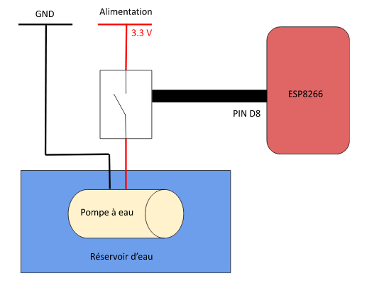

# Projet Jardin Intelligent
## Librairies utilisées :
  -Grove_Temperature_And_Humidity_Sensor : https://github.com/Seeed-Studio/Grove_Temperature_And_Humidity_Sensor  
  -SEEED_LED_STRIP : https://github.com/Seeed-Studio/Seeed_Led_Strip  
  -Grove - LCD RGB Backlight : https://github.com/Seeed-Studio/Grove_LCD_RGB_Backlight
## Installation Pompe : 

## Installation fichiers :  
Télécharger le .zip, dézipper puis placer les fichiers contenus dans sources et include avec le .ino.  
Executer le .ino puis téléverser le programme sur le microprocesseur.

## Fin de l'installation
